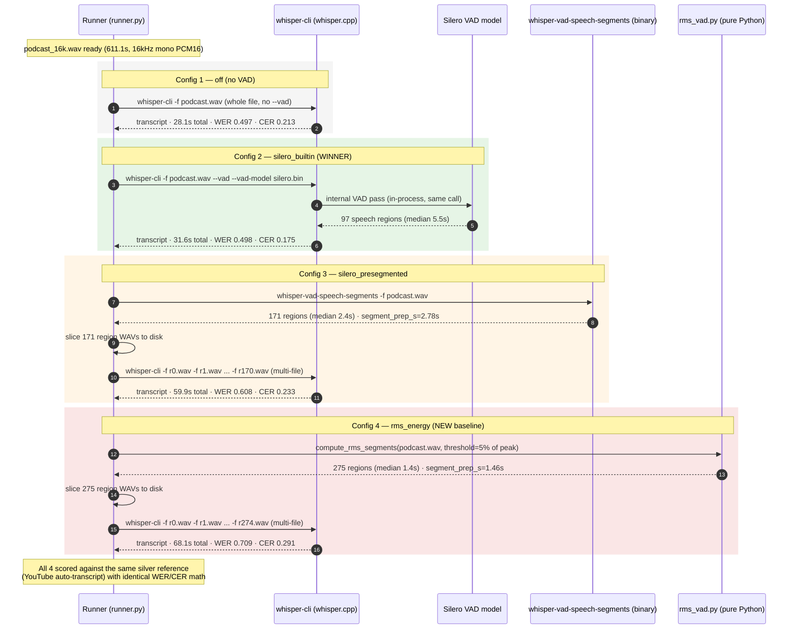
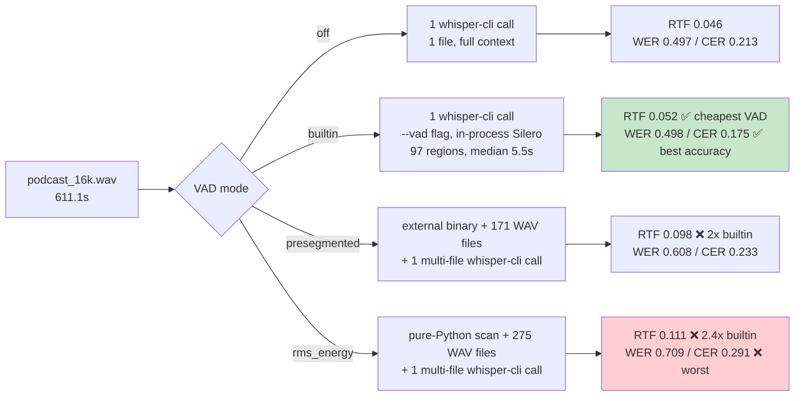

# RMS-Energy VAD vs Silero VAD — Result Report

> One real run on the Jetson, four VAD modes, same audio, same reference,
> same model. This doc explains what was compared, how each mode works, why
> Silero (built-in) wins on both accuracy and speed, and — since the
> downstream consumer is `ai4db`'s liblouis braille pipeline — what that
> means for the text actually reaching a braille reader (§8).

---

## 1 · The question

> Does the neural VAD (Silero, what `ai4db` ships in production) actually
> buy us anything over a classic, non-neural energy-threshold VAD (RMS
> energy) — or over no VAD at all?

## 2 · What ran

| | |
|---|---|
| **Host** | Jetson Nano (aarch64, 6 cores, 7.9 GB RAM) |
| **Whisper** | `whisper.cpp 1.9.1`, model `ggml-tiny.id.bin` |
| **Audio** | `data/podcast.mp3` — Indonesian podcast, **611.1 s** (~10.2 min) |
| **Reference** | YouTube auto-transcript (**silver**, not gold — WER/CER are *relative* between configs, not absolute accuracy) |
| **Threads** | 4 per config |
| **Command** | `uv run python -m scripts.run_benchmark --config name=off,vad_mode=off --config name=silero_builtin,vad_mode=builtin --config name=silero_presegmented,vad_mode=presegmented --config name=rms_energy,vad_mode=rms_energy` |

Four configs, same audio, same reference, same model — only `vad_mode` changes:

| Config | Mode | How it decides "speech" |
|---|---|---|
| `off` | no VAD | nothing — whole file goes to whisper as one buffer |
| `silero_builtin` | Silero (in-process) | whisper.cpp's own `--vad --vad-model` call, one whisper-cli process |
| `silero_presegmented` | Silero (external binary) | separate `whisper-vad-speech-segments` binary finds regions first, each region sliced to its own WAV, all passed to whisper-cli as multiple `-f` files |
| `rms_energy` | **RMS energy (new, non-neural)** | pure-Python: per-30ms-frame RMS vs. 5% of the file's peak RMS, same multi-file slicing as `presegmented` |

---

## 3 · Headline results

| Config | WER ↓ | CER ↓ | RTF ↓ | Total time | Segments | Silence removed |
|---|---:|---:|---:|---:|---:|---:|
| `off` | 0.497 | 0.213 | **0.046** | 28.1 s | 111 | — |
| **`silero_builtin`** | 0.498 | **0.175** | 0.052 | 31.6 s | 97 | 14.6% |
| `silero_presegmented` | 0.608 | 0.233 | 0.098 | 59.9 s | 171 | 20.1% |
| `rms_energy` | 0.709 | 0.291 | 0.111 | 68.1 s | 275 | 23.7% |

*(RTF = total time ÷ audio length; < 1.0 = faster than real-time. Lower is better across every column.)*

**Bottom line: `silero_builtin` wins on accuracy (best CER, WER ≈ tied with no-VAD) and is the cheapest VAD mode to run (+12% time vs `off`, vs. +113%/+142% for the other two).**

---

## 4 · "Shorter segments = lighter load"? Not on this data.

A natural intuition: chopping audio into short pieces before whisper sees it
should make whisper's job *easier*, since it processes less at a time.

Segment-length distribution says otherwise:

| Config | Median segment | Mean | Max | >10s segments |
|---|---:|---:|---:|---:|
| `silero_builtin` | 5.51 s | 6.12 s | 14.5 s | 8 |
| `silero_presegmented` | 2.39 s | 2.86 s | 10.5 s | 2 |
| `rms_energy` | **1.38 s** | 1.70 s | 11.7 s | 1 |

`rms_energy` produces the *shortest* segments (median 1.4 s) and the
*most* of them (275, vs. 97 for `builtin`) — and is simultaneously the
**slowest** and **least accurate** of all four configs.

**Why shorter ≠ lighter here:**

1. **Per-file overhead dominates.** `presegmented` and `rms_energy` slice
   each region to its own WAV, then hand whisper-cli 171–275 separate `-f`
   files in one multi-file call. Every file pays a fixed decode/context-init
   cost regardless of how short it is — 275 small files cost more overhead
   than 97 medium ones, even though the total speech duration is similar.
2. **Whisper wants sentence-length context.** Whisper's decoder was trained
   on ~30 s windows with full sentence context. A 1–2 s slice can cut a
   sentence or even a word in half; the model loses the surrounding context
   it needs to decode correctly — accuracy drops (WER 0.498 → 0.709) *and*
   time goes up (more segments to decode, each paying its own overhead).
3. **The `segment_prep_s` cost is real but small next to the transcribe
   cost.** Slicing itself took 1.5–2.8 s — the bulk of the extra time
   (`rms_energy`: 66.6 s of *transcription*, not slicing) comes from
   whisper-cli processing many small files, not from the Python
   segmentation step.

So "lighter for whisper" would require *fewer, longer* well-placed cuts —
which is exactly what Silero's neural boundary detection does (median 5.5 s,
sentence-shaped) versus a fixed energy threshold that chops on every dip in
loudness (median 1.4 s, word/syllable-shaped).

---

## 5 · Sequence diagram — same audio, four different roads to a transcript



---

## 6 · Why `silero_builtin` is both the most accurate and the lightest VAD mode



**Why `builtin` stays cheap:** one process, one file, VAD runs as an
internal pass inside the same whisper-cli invocation — no disk I/O for
per-region WAVs, no repeated whisper context re-init per file.

**Why `presegmented`/`rms_energy` cost more:** both take the
"slice-to-disk, then multi-file transcribe" road. Every extra file is
extra decode-context setup for whisper.cpp, on top of the Python/binary
time spent finding and writing the regions in the first place.

---

## 7 · Practical takeaway

| If you need... | Use |
|---|---|
| Best accuracy, lowest resource use on Jetson, and the cheapest/cleanest braille output downstream | **`silero_builtin`** — the ai4db production choice, confirmed |
| A quick non-neural sanity baseline (no model file, pure Python) | `rms_energy` — but expect worse WER/CER *and* worse RTF *and* ~6% more braille cells for the same audio, not a lighter-weight option anywhere in the pipeline |
| A standalone segmenter for other tooling reasons | `silero_presegmented` — still Silero-quality boundaries, but the multi-file transcribe path costs 2x `builtin`'s time for no accuracy gain here |

VAD-segment length itself is a non-issue for the braille step (§8) — whisper
runs with `--no-timestamps` in production, so liblouis only ever sees one
flat transcript string, translated in ~20 ms regardless of mode. What
*does* carry through is transcript quality: a cleaner transcript (`builtin`)
produces measurably fewer, cheaper braille cells than a fragmented one
(`rms_energy`).

**Caveat carried over from the benchmark's standing caveats:** this is one
Indonesian podcast clip scored against a *silver* (YouTube auto-transcript)
reference — WER/CER are useful for *ranking these four configs against each
other*, not as absolute accuracy numbers. The ranking (`builtin` > `off` ≈
`presegmented` > `rms_energy` on CER; `builtin` cheapest of the VAD modes)
is the signal to trust from this run.

---

## 8 · Does VAD-segment length matter once liblouis gets the text?

The production `ai4db` pipeline feeds whisper's output to `liblouis`
(`translateString(["unicode.dis", "id-id-g2.ctb"], text)`) to produce braille
dots. Whisper-cli runs with `--no-timestamps` in production
(`stt/whisper_bridge.py`), so it returns **one flat transcript string per
utterance** — the internal VAD segment boundaries (5.5 s median for
`builtin`, 1.4 s for `rms_energy`) are never exposed past that point.
liblouis only ever sees the final joined text.

To confirm this empirically rather than just reason about it, each config's
transcript was piped through the **actual production call**
(`louis.translateString`, `id-id-g2.ctb`, the Indonesian Grade-2 table
`ai4db` uses) on the Jetson:

| Config | Input words | Braille cells out | Translate time |
|---|---:|---:|---:|
| `off` | 1080 | 5697 | 0.0219 s |
| **`silero_builtin`** | 1057 | **5634** (fewest) | **0.0173 s** (fastest) |
| `silero_presegmented` | 1066 | 5692 | 0.0174 s |
| `rms_energy` | 1090 | 5961 (most) | 0.0180 s |

**Two things fall out of this:**

1. **liblouis translate time is irrelevant to VAD-segment length.** 7,442
   characters translate in ~17-22 milliseconds regardless of mode — three
   orders of magnitude below anything a user would notice, and it doesn't
   correlate with segment count (`rms_energy` has 275 segments feeding into
   its transcript, `builtin` has 97; translate time is within noise of each
   other). liblouis operates on the final string, not on audio segments.
2. **`silero_builtin` produces the *cheapest* braille output, not just the
   most accurate transcript.** Fewer garbled/split words means fewer,
   longer Grade-2 contractions instead of many short ones — 5634 cells vs.
   5961 for `rms_energy` (+327 cells, +5.8%) for describing the *same*
   ~10-minute clip. On a physical braille display with a fixed cell count
   per line (e.g. a 14-cell Focus 14), that's real, measurable extra
   scrolling for the end user — a second-order cost of a worse transcript
   that doesn't show up in WER/CER alone.

### Three aligned excerpts — same audio window, four transcripts, four braille outputs

Each block below pulls the same time window across all four configs so the
degradation (or lack of it) is visible directly, not just in aggregate
numbers.

#### Window 0–15s (opening line)

| Config | Text | Braille cells |
|---|---|---:|
| `off` | *"Yang saya sesalkan adalah beberapa kawan-kawan, melenial ataupun jenzi, melihat situasi ini tidak memandang secara suk turau, biom menyalakan diri seghip, kenapa saya dipaihata karena saya tidak counterten, bukan karena memang dia mendorbe korban secara suk turau,"* | 194 |
| **`silero_builtin`** | *"yang saya sesalkan adalah, doberapa kawan-kawan. Melenial ataupun jenzi, melihat situasi ini tidak memandang secara sukturau. Bia menyalakan hidis-hikip, kenapa saya dipehatah karena saya tidak kompeten. Nenekan, karena ngemangnya, merdua di korban secara sukturau."* | 203 |
| `silero_presegmented` | *"yang saya sesuatu penandera. untuk berapa kawan-kawan. melenial ataupun jenzi, melihat situasi ini. tidak memandang secara suk pura. Biasanya lakani disedih. kenapa saya dipehatan karena saya tidak kontoknya? bukan permanent yang menggniah mengembangkan di korbanistya rasuk-kurau"* | 205 |
| `rms_energy` | *"yang saya sehalkan dan derla. dobra pa. Kauan Kauan. Melenial ataupun jenzi Mali haksit posi ini. Tidak memandang secara suk. Bula. Biasanya akan niris gitu. kenapa saya dipehata karena saya tidak kompeten. kan permanent yang menggniah."* | 186 |

All four are rough at the opening (the tiny model + silver reference means
even `off` isn't clean), but note `rms_energy`'s **"dobra pa. Kauan Kauan."**
— two whole words ("beberapa", "kawan-kawan") shredded into fragments and
capitalized as if they were separate sentences. That's a direct symptom of
cutting mid-word: RMS energy detected a dip in loudness *inside* "beberapa"
and "kawan-kawan" and inserted a hard segment boundary there.

#### Window 150–165s (mid-clip — the clearest example)

| Config | Text |
|---|---|
| `off` | *"itu nyantah jauh lebih besar. Tukis cara seluhan kalau ngomong STEM, asyat negara itu hanya bisa memproduksi itu jauh rotoslima-pluribu, produkt STEM-stown dibandingkan India..."* |
| **`silero_builtin`** | *"**Mereka juga investasi di stem atau science technology engineering mathematics**, itu nyata, jauh lebih besar. Tukis cara seluruh yang kalau ngomong stem, asyat negara itu hanya bisa memproduksi itu juratus-limapuri buk..."* |
| `silero_presegmented` | *"itu nyantah jauh lebih besar kecil harus seluruh, kalau ngomong stem, asyeteng geratu, hanya bisa memproduksi itu jelas-jurat-usli memapur ribu..."* |
| `rms_energy` | *"itu nyantah jauh lebih besar Jadi secara seluruh, hangung-kalangan mengstem, asyetengen retuhan yang bisa memproduksi itu jelas-jurat-usli memapur ribu..."* |

This is the sharpest example in the run. **Only `silero_builtin` captures the
opening clause** — "Mereka juga investasi di stem atau science technology
engineering mathematics" ("They also invest in STEM, or science technology
engineering mathematics"). `off`, `presegmented`, and `rms_energy` all start
mid-sentence at *"itu nyantah..."*, meaning a whole clause of speech was
either missed entirely or merged unrecognizably into the previous segment in
those three modes. Silero's neural boundary detection found a real pause
that the other three methods didn't — a case where using VAD at all (and
using it well) recovers content that would otherwise be lost, not just
reduce processing time.

#### Window 300–315s (later section)

| Config | Text |
|---|---|
| `off` | *"Nah, kenapa terjadi informalisasi? Tentunya ini yang fundamental sekali adalah kurangnya, kualitas mendikan biru ni-sia, dan kurangnya investasi kita di stem..."* |
| **`silero_builtin`** | *"Nah, kenapa terjadi informa-lisasi? Tentunya ini yang fundamental sekali adalah kurangnya, quality dikandir Indonesia. Dan kurangnya investasi kita di stem..."* |
| `silero_presegmented` | *"Nakkan yang poterjadi informalisasi, tentunya ini yang fundamental sekali adalah kurangnya, quality-spendikan biru-bisia. dan kurangnya investasi kita di stem..."* |
| `rms_energy` | *"Kami empat rejadi informalisa. Tentunya ini yang mau. pun demen tau sekali ada lah. kurangnya, quality suspension dikan biru nyesia..."* |

Here the gap is more subtle — all four get the gist — but `rms_energy`
again shows the clearest fragmentation: **"Nah, kenapa terjadi..."** (a
smooth opening in the other three) becomes **"Kami empat rejadi..."**, an
outright misrecognition, plus extra sentence-breaking mid-thought
("Tentunya ini yang mau. pun demen tau sekali ada lah.") that isn't present
in `builtin`'s version.

**Reading across all three windows:** `silero_builtin` is consistently the
version closest to a clean, single-clause reading — exactly what a braille
reader benefits from, since braille reading is inherently serial (one cell
group at a time) and doesn't forgive fragmented, mis-punctuated text the way
a sighted skim-reader might.

---

## Appendix · Raw numbers

```
off                  mode=off          WER=0.4971 CER=0.2130 RTF=0.0460 total_s=28.12  n_seg=111
silero_builtin       mode=builtin      WER=0.4981 CER=0.1750 RTF=0.0516 total_s=31.56  n_seg=97
silero_presegmented  mode=presegmented WER=0.6076 CER=0.2331 RTF=0.0980 total_s=59.91  n_seg=171
rms_energy           mode=rms_energy   WER=0.7093 CER=0.2906 RTF=0.1114 total_s=68.10  n_seg=275

best_wer_config:     off              (0.4971)
best_cer_config:     silero_builtin   (0.1750)
fastest_rtf_config:  off              (0.0460)
```

Segment-duration distribution:

```
silero_builtin        n=97  min=1.00  median=5.51  mean=6.12  max=14.54  p90=9.99  >10s=8
silero_presegmented   n=171 min=0.19  median=2.39  mean=2.86  max=10.53  p90=5.63  >10s=2
rms_energy             n=275 min=0.33  median=1.38  mean=1.70  max=11.67  p90=3.06  >10s=1
```

Run identity: Jetson Nano, `whisper.cpp 1.9.1`, `ggml-tiny.id.bin`, 4
threads/config, manifest `2026-07-20_05-14-07_22cd8d88` in
`reports/history/` on the Jetson host.
